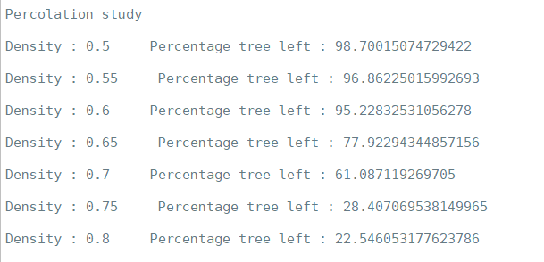

# Simulation de feu de forêt
Ce projet consistait à simuler des feux de forêt en utilisant des automates cellulaires. Il s'agissait aussi de faire une étude de percolation autour de la densité de la forêt afin de définir un seuil au-delà duquel plus de la moitié de la forêt prendrait feu.
[insérer simu version cliquable]

### Composition de la forêt
La forêt est constituée de 3 types d'arbres différents :
- les arbres normaux
- les arbres résitants
- les arbres inflammables

La forêt compte aussi des points d'eau qui représentent 15% de l'espace vide, ou espace sans arbre. La particularité des points d'eau est qu'ils arrêtent le feu, même s'il y a du vent. Cependant, ils peuvent être contournés.

### Les différents types d'arbre
#### Les arbres normaux
Ils sont représentés par des [insérer carré vert] et consituent 70% des arbres de la forêt. Ces arbres ont une probabilité normale de s'enflammer, c'est-à-dire qu'ils s'enflamment lorsqu'au moins un de leurs voisins est en feu. On ne comptera pas les voisins en diagonale. Les arbres normaux ne brûlent pas si le vent souffle dans la direction opposée.

#### Les arbres résistants
Ils sont représentés par des [insérer carré vert foncé] et constituent 20% des arbres de la forêt. Ces arbres ont une probabilité faible de s'enflammer. Ils doivent s'enflammer deux fois pour être détruits. La première fois, ils ne prennent feu que lorqu'au moins 3 de leurs voisins sont en feu. Ils changent alors d'état et deviennent des arbres normaux.
[insérer simu arbre résistant]

#### Les arbres inflammables
Ils sont représentés par des [insérer carré bordeaux] et constituent 10% des arbres de la forêt. Ces arbres ont une probabilité très élevée de s'enflammer. Ils prennent feu dès lors qu'un de leurs voisins est en feu, même si le vent souffle dans la direction opposée.

### Les vents
L'action des différents vents est prise en compte dans la simulation. Quand un vent est actif, le feu se propage une case plus loin dans la direction du vent, et ne se propage plus dans la direction opposée. Par défaut, il n'y a pas de vent. Il faut paramétrer le vent souhaité à **True** dans l'initialisation de la scène pour que le vent souhaité puisse agir sur l'évolution du feu.
```python
scene = Scene(north_wind=True)
```
Pour des raisons de simplification, les différents vents s'additionnent. C'est-à-dire que si le vent nord et le vent est sont activés en même temps, on obtient un vend qui va dans la direction nord-est. Cependant, les vents opposés ne peuvent pas être actifs en même temps, c'est-à-dire que le vent du nord ne peut pas être actif en même temps que le vent du sud.
[insérer image boussole vent nord] [insérer image boussole vent est] [insérer image boussole vent nord-est]
[insérer simu vent nord est]

### Étude de la percolation
Pour étudier la percolation, le feu se propage depuis la cellule du centre. J'ai fait une boucle sur plusieurs densités :
```python
densities = [0.50, 0.55, 0.60, 0.65, 0.70, 0.75, 0.80]
```
Pour chaque densité, je lance la simulation 40 fois puis je calcule la moyenne du pourcentage d'arbres restants. Voici les résultats obtenus :



### Composition du code
Le code est constitué de deux classes : Scene et Grid.
La classe Scene est utilisée pour tout ce qui est interface graphique, tandis que la classe Grid est utilisée pour les événements liés à la forêt.

#### Classe Grid
Dans cette classe, il y a 11 fonctions sans compter la fonction ```__init__(self) ``` :  

3 fonctions d'initialisation de composantes de la forêt
* ```_initResistantTrees_(self) ``` qui initialise les arbres résistants en prenant 20% des arbres initialisés dans ```__init__(self) ```
* ```_initInflammableTrees_(self) ``` qui initialise les arbres résistants en prenant 10% des arbres initialisés dans ```__init__(self) ```
* ```_initWater_(self) ``` qui initialise les points d'eau en prenant 15% de l'espace vide  

5 fonctions comptant les arbres restants
* ```treeCount(self) ``` qui compte le nombre d'arbres restants peu importe le type
* ```resitantTreeCount(self) ``` qui compte le nombre d'arbre résistants restants
* ```inflammableTreeCount(self) ``` pour les arbres inflammables
* ```normalTreeCount(self) ``` pour les arbres normaux
* ```percentageTreeLeft(self) ``` qui compte le pourcentage d'arbres restants   

3 fonctions concernant les voisins
* ```allCells(self) ``` qui retourne toutes les cellules de la grille
* ```countFireNeighbours(self) ``` qui compte le nombre d'arbres voisins enflammés
* ```neighbourIndex(self) ``` qui met à jour les voisins en fonction du vent
```python
        if self._north_wind:
            # remove north neighbours unless cell contains vulnerable tree
            if self._grid[x,y]!=5:
                del neighbourIndex["north"]
            # add south neighbour unless there is water or if south_wind is enabled
            # for simplification reasons, adverse winds cancel each other
            if y+1<__gridDim__[1] and self._grid[x,y+1]!=4 and self._south_wind==False:
                neighbourIndex["south2"]=(0,2)
```
Ici, nous avons un extrait du code de la fonction ```neighbourIndex(self) ```. La liste des voisins est un dictionnaire ```_dictNeighbourIndex = {"north" : (0,-1), "south" : (0,1), "east" : (1,0), "west" : (-1,0)}``` initialisé au début de la classe. ```self._grid[x,y]!=5``` correspond aux arbres inflammables. Lorsque le vent nord est activé, on supprime le voisin "north" sauf s'il s'agit d'un arbre inflammable. En effet, vent nord ici signifie le vent qui se dirige vers le nord. Or on n'utilise les voisins que pour compter le nombre de voisins en feu et ainsi calculer la probabilité de prendre feu. On ne prend donc pas en compte les voisins du nord pour un vent nord, car on vend que le feu se propage vers le nord. On vérifie bien ```self._south_wind==False``` car les vents opposés s'annulent dans notre simulation. Et on prend en compte un voisin situé une case plus bas vers le sud pour que le feu se propage une case plus vite vers le nord.

#### Classe Scene

### Améliorations possibles
- faire des fleuves et des lacs au lieu d'initialiser des points d'eau individuel
- ajouter la régénération de la forêt après un certain temps
- ajouter la pluie qui se déclenche aléatoirement et qui peut éteindre le feu
- voir le pourcentage d'arbres restants pour chaque type d'arbre


